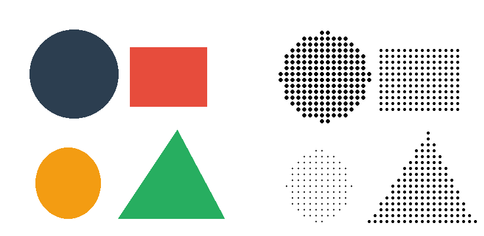

# Dot Matrix Art

A photo-to-dot-matrix converter with a full-featured Tkinter GUI. Transform any image into dot matrix art using a variety of dot patterns, artistic effects, and export options.



## Features

- **11 dot pattern types**: circle, square, diamond, hexagon, star, cross, heart, triangle, halftone, stipple, ASCII
- **Artistic effects** with configurable parameters
- **Real-time preview** in the GUI
- **Camera capture** support (requires OpenCV)
- **Face detection** for intelligent cropping (requires OpenCV)
- **Batch processing** and export
- **Project save/load** via JSON
- **Multi-threaded** processing for responsive UI

## Requirements

- Python 3.7+
- Pillow (PIL)
- NumPy
- tkinter (included with Python)
- OpenCV (optional, for camera and face detection)

```bash
pip install Pillow numpy opencv-python
```

## Usage

```bash
# Run the latest version
python photo_to_dot_matrix_v3.py
```

### Workflow

1. Load an image via the GUI file dialog
2. Choose a dot pattern type
3. Adjust dot size, spacing, and artistic effects
4. Preview the result in real time
5. Export the dot matrix art

## Versions

| File | Description |
|------|-------------|
| `photo_to_dot_matrix.py` | Original version |
| `photo_to_dot_matrix_v2.py` | Added more patterns and effects |
| `photo_to_dot_matrix_v3.py` | Full GUI with camera, face detection, batch processing |

## Project Structure

```
dotMatrix_art/
├── photo_to_dot_matrix.py      # Original converter
├── photo_to_dot_matrix_v2.py   # Enhanced version
├── photo_to_dot_matrix_v3.py   # Full-featured GUI application
├── dot_matrix_projects/
│   └── gallery/                # Saved gallery images
├── examples/
│   └── dot_matrix_example.png  # Example output
└── README.md
```
